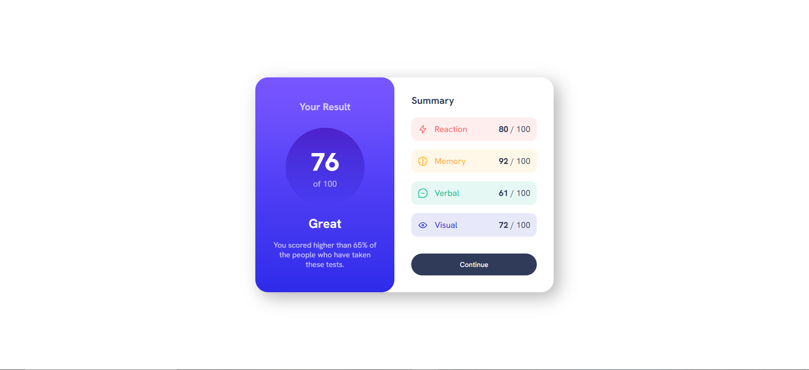

# Frontend Mentor - Results summary component solution

This is a solution to the [Results summary component challenge on Frontend Mentor](https://www.frontendmentor.io/challenges/results-summary-component-CE_K6s0maV).

## Table of contents

- [Overview](#overview)
  - [Screenshot](#screenshot)
  - [Links](#links)
  - [Built with](#built-with)
  - [What I learned](#what-i-learned)
  - [Useful resources](#useful-resources)

## Overview

This is a results summary display component that I took as a challenge to freshen up my flexbox and responsiveness skills 

### Screenshot

### Links

- [GitHub Link](https://github.com/major101x/results-summary/)
- [Live Site](https://major101x.github.io/results-summary/)

### Built with

- HTML
- CSS
- Flexbox

### What I learned

I refreshed my knowledge of flexbox and responsive media queries

### Useful resources

- [Josh W. Comeau's gradient generator](https://www.joshwcomeau.com/gradient-generator/) - This helped me to generate the gradients for the result and score display.
